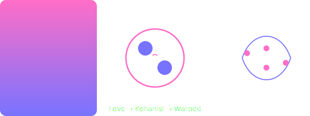

### Glyph Scheme: Love → Kohanist → Warped

| Stage | Field Equation | Metric |
|---|---|---|
| **Love** | Background potential ϕ♥ | L ∈ [0,1] |
| **Kohanist** | Mutual coherence K = H + intent | K ∈ [0,1] |
| **Warped** | Curvature operator Ω(glyph) → ℝⁿ | new glyphs emerge |



Quick embed:
```bash
cp assets/glyph-scheme.svg docs/
```